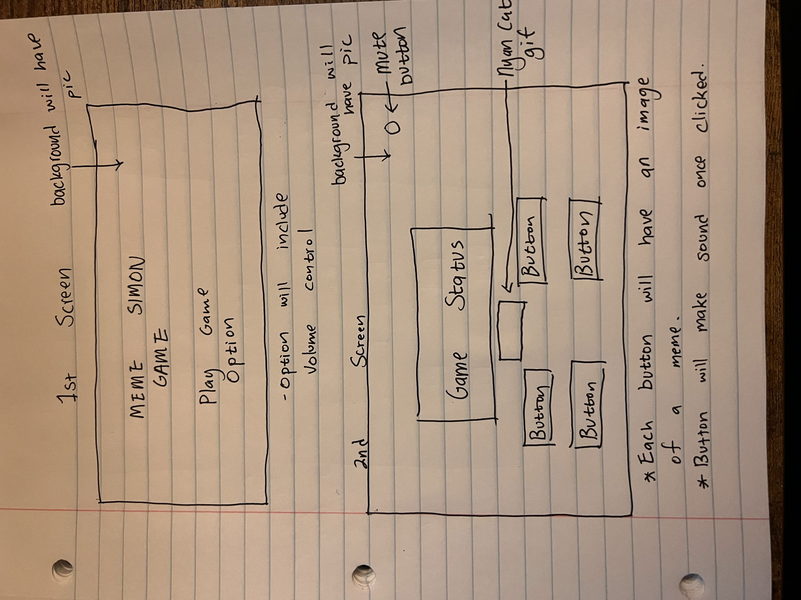

# THE MEME SIMON GAME
## Project Summary
---
Have you ever wondered how good your memorization skill is? If you were wondering, The MEME Simon Game is here to help you test your memorization skill!! The game will create a series of buttons lighting up and the player will be required to repeat the sequence. If the player succeeds, the series will become progressively longer and more complex. If the player fails to match the sequence or runs out of time, the game will be over.

### The Tech 
---
The tech that is involved in this project is HTML, CSS, Javascript and Document Object Model (DOM).

### MVP
---
- Render a start screen with a start button and a option. The option setting will have a mute button allowing players to mute the background music and SFX.
- Render game screen displaying the game status that includes the longest streak and a timer. If a player either wins or loses the game, a text will be displayed on the game status screen. A MEME picture will be shown below the text as well to provide entertainment.
- Create 4 responsive buttons for the player to click (Each button will have a picture of a MEME)
- Render a screen under the game screen displaying a Nyan Cat gif or any meme gif that is constantly running in the background (Just for fun).
- Create a max of 10 ~ 14 sequences for the game.
- Create a mute button that mutes all sound.

### Wireframe
---

### Stretch Goals
---
- Have the 4 responsive buttons make different sound when clicked
- Timer becomes shorter as the sequence gets longer 
- Create a quit button and once the button is clicked a popup will appear asking the user again if they want to quit the game (a picture of a meme will be under that)
