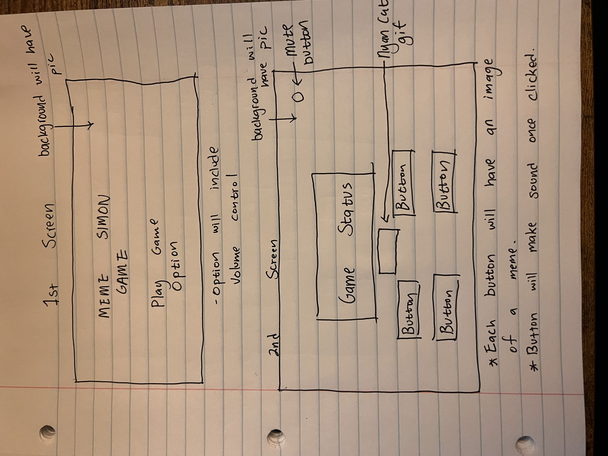

# THE MEME SIMON GAME
## Project Summary
---
Have you ever wondered how good your memorization skill is? If you were wondering, The MEME Simon Game is here to help you test your memorization skill!! The game will create a series of buttons lighting up and the player will be required to repeat the sequence. If the player succeeds, the series will become progressively longer and more complex. If the player fails to match the sequence the game will be over.
### The Tech 
---
The tech that is involved in this project is HTML, CSS and Javascript.

### MVP
---
- Render a start screen with a start button and an instructions button.
- Render game screen displaying the game status that includes the level. If a player either wins or loses the game, a text will be displayed on the game status screen.
- Create 4 responsive buttons for the player to click (Each button will have a picture of a MEME)
- Background image with an image gif
- Create a max of 10 sequences for the game.

### Wireframe
---

### Stretch Goals
---
- Have the 4 responsive buttons make different sound when clicked
- Create a timer
- Create a quit button and once the button is clicked a popup will appear asking the user again if they want to quit the game (a picture of a meme will be under that)
- Adding background music & SFX to all elements (Add an option button that has a mute all music function.)
